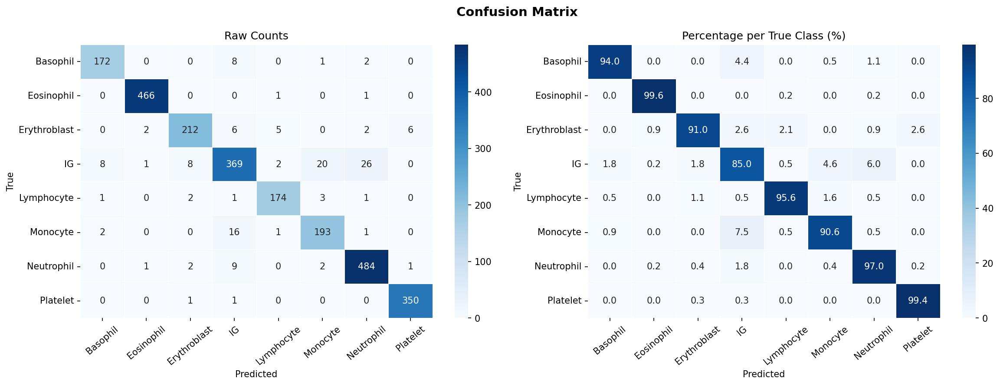
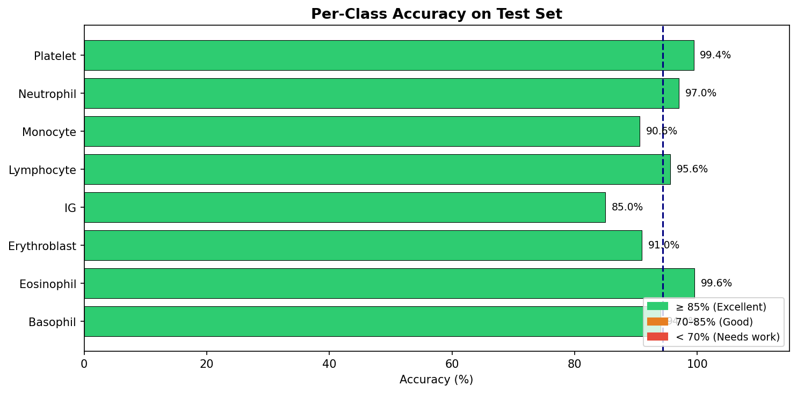
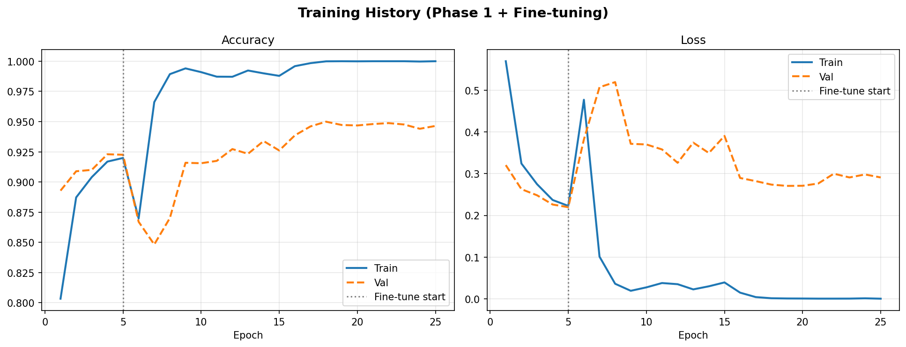

# Blood Cell Classification with Deep Learning

Classification of ~17k microscopy images into 8 blood cell types using transfer learning (MobileNetV2) with two-phase fine-tuning.

**Test accuracy: 94.4%**

## Dataset
[Blood Cells Image Dataset (Kaggle)](https://www.kaggle.com/datasets/unclesamulus/blood-cells-image-dataset)
Download it and place it in a folder named `blood-cells-image-dataset/` next to `prj1.py`.

## Method
- 70/15/15 stratified train/validation/test split, images resized to 96×96
- Phase 1: train the classification head on a frozen MobileNetV2 (ImageNet weights)
- Phase 2: fine-tune the last 30 layers with a lower learning rate, EarlyStopping and ReduceLROnPlateau

## Results

## Tech
Python, TensorFlow/Keras, scikit-learn, NumPy, Matplotlib, Seaborn
